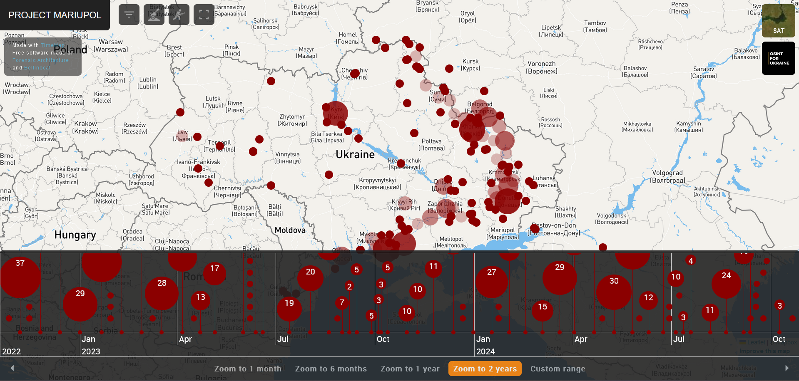

# Project Mariupol Timemap 2.0

TimeMap is a tool for sourcing and mapping of potential international crimes committed in Ukraine, using API of <a href="https://github.com/bellingcat/ukraine-timemap">Civilian Harm Ukraine-Timemap</a>, with special thanks to <a href="https://github.com/forensic-architecture">Forensic Architecture</a> for the original repository: <a href="https://github.com/forensic-architecture/timemap">forensic-architecture/timemap</a>.

The original project is written using React Class based Components. The Timemap 2.0 refactors the original project using React Hooks.

[How can I contribute?](#how-can-i-contribute) | [Setting up the project locally](#setting-up-the-project-locally) | [Code of conduct](#code-of-conduct) | [About OSINT for Ukraine](#about-osint-for-ukraine) 

## How can I contribute
We welcome contributions! If you want to make any change to this repository, please make a fork first and read our [Contribution Guide](CONTRIBUTING.MD). 

## Setting up the project locally

To set up the project locally, run 

`npm install`

`npm run dev`

To build the app and preview the production build, run

`npm run build`

`npm run preview`

## About OSINT for Ukraine

OSINT FOR UKRAINE is an independent investigative (non-profit) foundation dedicated to using Open Source Intelligence to investigate International crimes committed in relation to the Russo-Ukrainian war, Research Influence and Disinformation operations in Europe, and to provide Specialized OSINT and OPSEC advisory and training. The foundation comprises a multinational team of professionals who possess knowledge and professional experience in Intelligence, OSINT investigations, international criminal, humanitarian and human rights law as well as investigative journalism. 

Currently, OSINT FOR UKRAINE has three operational departments and supporting departments/groups (Public Affairs, General Secretariat and Operational Security), which amounts to more than 70 members (board, staff and volunteers).

If you want to learn more details about our projects [visit our site](https://www.osintforukraine.com/).

## Code of conduct

This project and everyone participating in it is governed by the [OSINT for Ukraine Code of Conduct](CODE_OF_CONDUCT.md). By participating, you are expected to uphold this code.

